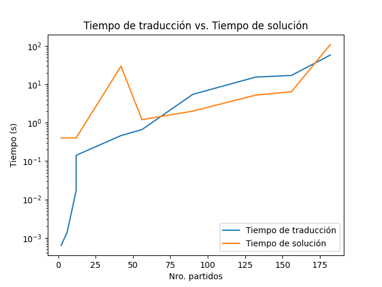

#
### CI5437 - Inteligencia Artificial 1
##### Prof. Carlos Infante

# Proyecto 3

Por <a href='https://www.github.com/chrischriscris'>Chus</a> | <a href='https://www.github.com/fungikami'>K</a>

## 1. Introducción

Planificar horarios es una tarea que puede ser relativamente común y a la vez compleja en el mundo real, dependiendo de qué tan restringido tenga que ser el horario o cuántos eventos se tengan que planificar y los demás factores involucrados. Por otro lado, es sabido que la planificación de horarios es un problema NP-completo, por lo que no podemos esperar que la con la ayuda de una computadora se pueda resolver en tiempo polinomial, sin embargo, sí podemos esperar que para casos relativamente pequeños o con muchas posibles soluciones un algoritmo pueda encontrar una de ellas en un tiempo razonable menor al que tomaría a un humano.

Luego, el problema de satisfacibilidad booleana (SAT) es otro problema NP-completo (de hecho el primero en ser probado como tal) que consiste en determinar si existe una asignación de valores booleanos a un conjunto de variables que satisfaga una fórmula booleana. Este problema ha sido a lo largo de los años uno de los más estudiados en el área de la computación, por lo que existen muchas técnicas y algoritmos que permiten explorar el espacio de búsqueda de forma inteligente y eficiente para intentar encontrar la solución a ciertas instancias en un tiempo razonable, explotando al máximo sus características y propiedades.

Con esto en mente, lo que hace de gran interés al problema SAT es que es posible reducir cualquier problema NP-completo a una instancia de SAT en tiempo polinomial, por lo que un solver eficiente de SAT puede ayudar a resolver problemas para los que no fue diseñado originalmente y para los que no se conocen algoritmos específicos eficientes.

Así, lo que se busca en este proyecto es resolver un problema de planificación de horarios utilizando un solver de SAT, traduciendo primero el problema a una instancia de SAT y luego traduciendo la solución dada por el solver a una solución del problema original; de esta forma, se tiene el propósito de ganar un entendimiento más profundo de estos problemas, su utilidad, sus limitaciones y por qué son tan importantes en el área de la computación.

## 2. Detalles de implementación

### 2.1. Representación del problema

El problema se modela como un problema de satisfacibilidad booleana (SAT) con las siguientes variables y restricciones.

$x_{ijkl}$: Variable que representa si el jugador $i$ juega local contra el jugador $j$ el día $k$ a la hora $l$ (hora de inicio).

$$x_{ijkl} \in \{\text{True}, \text{False}\}$$

$$i,j \in [0..n), \; n \geq 2$$

$$k \in [0..d), \; d\geq 2$$

$$l \in [0..h-1), \; h \geq 2$$

Número de variables: $n^2d(h-1)$

Véase que el dominio de $l$ es $[0..h-1)$, pues al asumir de los juegos una duración de dos horas, el último juego del día debe empezar a más tardar a las $h-2$ horas.

Luego, no se consideran válidos los juegos de un solo jugador, de un solo día o de una sola hora, pues no sería de ninguna manera consistente con el problema de planificación propuesto.

Teniendo este marco, se procede a modelar las restricciones del problema usando lógica proposicional.

#### Restricciones

**Nota**: Se asume implícitamente que las variables tienen el dominio correcto de acuerdo a su posición en el subíndice.

**Nota**: El cálculo del número de cláusulas se encuentra comentado al final de cada restricción, puede consultarse para mayor detalle.

* Un participante no puede jugar contra sí mismo. $nd(h-1)$ cláusulas.

$$(\forall i, k, l: \neg x_{iikl})$$

* Todos los participantes deben jugar dos veces con cada uno de los otros participantes, una como "visitantes" y la otra como "locales". $n(n-1)$ cláusulas.

$$(\forall i, j| i \neq j: (\exists k, l|:x_{ijkl}))$$

* Dos juegos no pueden ocurrir al mismo tiempo. $n(n-1)d(n(n-1)-1)(2h-3)$ cláusulas.

$$ (\forall i, j, k, l | i \neq j :x_{ijkl} \implies \neg (\exists u, v|(i \neq u \lor j \neq v) \land u \neq v:x_{uvkl})) $$

$$ \land $$

$$ (\forall i, j, k, l | i \neq j \land l < h-2 :x_{ijkl} \implies \neg (\exists u, v|(i \neq u \lor j \neq v) \land u \neq v:x_{uvk(l+1)})) $$

<!--
Para un ijkl fijo:

n(n-1)-1 cláusulas (uv != ij)
(
    -xijkl v -xuvkl ^
    ...
) ^
n(n-1)-1 cláusulas (uv != ij)
(
    -xijkl v -xuvkl+1 ^
    ...
) ^

Son n(n-1)d(h-1) y n(n-1)d(h-2) combinaciones de ijkl, respectivamente, por lo que el total de cláusulas es:

n(n-1)d(h-1)(n(n-1)-1) + n(n-1)d(h-2)(n(n-1)-1)

=

n(n-1)d((h-1)(n(n-1)-1) + (h-2)(n(n-1)-1))

=

n(n-1)d(n(n-1)-1)(h-1+h-2)

=

n(n-1)d(n(n-1)-1)(2h-3)
-->

* Un participante puede jugar a lo sumo una vez por día. $4n^2(n-1)d(h-1)(h-2)$ cláusulas.

$$(\forall i, j, k, l | i \neq j : x_{ijkl} \implies \neg (\exists p, q | q \neq l :x_{ipkq} \lor x_{pjkq} \lor x_{jpkq} \lor x_{pikq}))$$

<!--

xijkl => -((xinkm v xjkm v xjkm v xikm) v ...)

Para un ijkl fijo:

4n(h-2) cláusulas (l != m)
(
    -xijkl v -inkm ^
    -xijkl v -njkm ^
    -xijkl v -jnkm ^
    -xijkl v -nikm ^
) ^ ...

Son n(n-1)d(h-1) combinaciones de ijkl, por lo que el total de cláusulas es:

4n^2(n-1)d(h-1)(h-2)
-->

* Un participante no puede jugar de local ni de visitante en dos días consecutivos. $2n^2(n-1)(d-1)(h-1)^2$ cláusulas.

$$(\forall i, j, k, l | i \neq j \land k < d - 1 : x_{ijkl} \implies \neg (\exists p, q | :x_{ip(k+1)q} \lor x_{pj(k+1)q}))$$

<!--

xijkl => -((xipk+1q v xpjk+1q) v ...)

Para un ijkl fijo:

2n(h-1) cláusulas
(
    -xijkl v -ipk+1q ^
    -xijkl v -pjk+1q ^
) ^ ...

Son n(n-1)(d-1)(h-1) combinaciones de ijkl, por lo que el total de cláusulas es:

2n^2(n-1)(d-1)(h-1)^2

-->

* Todos los juegos deben empezar en horas "en punto" (por ejemplo, las 13:00:00 es una hora válida pero las 13:30:00 no).

* Todos los juegos deben ocurrir entre una fecha inicial y una fecha final especificadas.

* Todos los juegos deben ocurrir entre el rango de horas fijo especificado.

La forma en que se modela el problema garantiza que todos los juegos empiezan en horas "en punto", ocurren entre una fecha inicial y una fecha final especificadas, y en un rango de horas especificado.

* A efectos prácticos, todos los juegos tienen una duración de dos horas.

Una restricción arriba garantiza que no hayan juegos que se solapen en ninguna de las dos horas.

Así, el total de cláusulas está en el orden de $O(n^3dh^2 + n^4dh)$.

### 2.2 Traducción del problema en formato JSON a formato DIMACS

Para realizar el programa se utilizó el lenguaje de programación [Ruby](https://www.ruby-lang.org/es/), en su versión 3.2.2. Para la lectura del archivo JSON y de las fechas en el formato especificado, se utilizaron las librerías `json` y `time`, respectivamente, las cuales vienen incluidas en la librería estándar de Ruby; sin embargo, para la creación del archivo iCalendar se utilizó la gema `icalendar` en su versión 2.8.

Para traducir el problema a una instacia de SAT y escribir las cláusulas en el formato DIMACS se utilizaron los modelados de la sección anterior, las cuales se desarrollaron usando teoremas de lógica proposicional para llevarlas a su forma normal conjuntiva (CNF, conjunción de disyunciones) y luego se escribieron en el formato DIMACS.

Una decisión de diseño importante fue la forma en que se iban a generar las cláusulas y se iban a escribir en el archivo en formato DIMACS. Principalmente, se consideraron dos opciones: (i) generar todas las cláusulas en memoria y luego escribirlas en el archivo DIMACS, o (ii) generar y escribir las cláusulas en el archivo a medida que se iban generando, y dentro de cada opción se intentaron varias implementaciones.

i.a. Guardar las cláusulas en memoria usando un `Array` de Ruby.
i.b. Guardar las cláusulas en memoria usando un `Set` de Ruby, de esta forma se eliminarían cláusulas repetidas al coste de un mayor tiempo de ejecución (aunque el tiempo de acceso es constante debido a que se trata de una tabla de hash, las constantes ocultas son mayores que las de un `Array`).

ii.a. Escribir las cláusulas secuencialmente en el archivo.
ii.b. Escribir las cláusulas de forma paralela en el archivo, ya que el orden de las cláusulas no importa.
ii.c. Escribir cada una de las 5 restricciones en archivos distintos paralelamente y pasar al solver una concatenación in-place de los archivos.

De cada una de estas opciones consideradas, luego de hacer pruebas de rendimiento (principalmente con casos de prueba grandes, de decenas de millones de cláusulas), se observó que la opción (ii.a) era la más eficiente, por lo que es la que se utilizó en el programa final. Algunas notas interesantes de esta consideraciones fueron los siguientes:

+ La primera implementación considerada fue la (i.a), pero surgía el problema de que el gasto de memoria llegaba a ser alto para instancias relativamente grandes (de más de 700MB), y la preocupación era la del crecimiento vertiginoso de la memoria a medida que se aumentaba el número de participantes, días y horas (asintóticamente equivalente a $O(n^3dh^2 + n^4dh)$ como se refiere arriba).

+ Sorprendentemente, la implementación (i.b) no era mucho más lenta que la (i.a), pero a pesar de que lograba eliminar una cantidad no despreciable de cláusulas repetidas alrededor de 30 para casos de 90 cláusulas y 1 millón para casos de 13 millones de cláusulas, el gasto de memoria llegaba a incluso sobrepasar 1GB en este último caso, lo que iba en contra del diseño que se tenía en mente. Por otro lado, se puede pensar que el Solver de SAT a utilizar probablemente tenga un mecanismo de optimización que ya realice este trabajo de eliminar cláusulas repetidas, por lo que no se consideró esencial hacerlo en el programa.

+ La implementación (ii.a) fue posible sin mayor problema debido a que el cómputo del número de cláusulas referido en la sección anterior se realizó de forma correcta, lo que permitía colocar el número de cláusulas a la cabecera del archivo DIMACS de antemano sin necesidad de contadores adicionales o usar el tamaño del `Array` o `Set` de cláusulas, como se hacía en la implementación (i.a) y (i.b), respectivamente.

+ Aunque con la implementación de (ii.a) lo que se buscaba inicialmente solo era reducir el gasto de memoria para hacer viable la traducción para casos grandes, se observó que esta implementación resultaba mucho más rápida que las anteriores, lo que terminó siendo la razón principal para elegirla.

+ Para (ii.b) e (ii.c) se pueden encontrar bosquejos de la implementación en varias ramas del repositorio (`concurrency` y `concurrency-2`), sin embargo, ninguna de estas fue satisfactoria en términos de rendimiento, pues la escritura concurrente de un mismo archivo requiere un mecanismo de sincronización que termina siendo más costoso (para ii.b), y, por lo menos en un disco duro mecánico , la escritura paralela de varios archivos termina siendo más lenta que la escritura secuencial de un solo archivo (para ii.c) (de hecho, ni siquiera ocurre en paralelo sino en un solo lote al final, lo que puede deberse al scheduling del disco).

Desarrollando para la implementación escogida, para un caso de 10 participantes, 18 días y 20 horas (`../data/test0.json`), se observó que (i.a) tomaba en promedio 114 segundos para generar el archivo DIMACS, mientras que con el segundo caso el tiempo promedio de generación del archivo era de 15.5 segundos.

Siguiendo con los detalles de implementación, para mapear las variables del modelado (i.e. $x_{ijkl}$) a las variables del formato DIMACS (i.e. $x_{m}$), se ideó en principio la siguiente función biyectiva:

$$ f: \mathbb{N}^4 \to \mathbb{N} \setminus \{0\}$$

$$f(i, j, k, l) = (h-1)(d(in + j) + k) + l + 1$$

y su inversa:

$$ f^{-1}: \mathbb{N} \setminus \{0\} \to \mathbb{N}^4$$

$$f^{-1}(x) = (x \div (nd(h - 1)), (x \div (d(h - 1))) \mod n, (x \div (h - 1)) \mod d, x \mod (h - 1))$$

sin embargo, dado que se al generar las restricciones se itera numerosas veces sobre $[0..n) \times [0..n) \times [0..d) \times [0..h-1)$, se decidió utilizar un arreglo de cuatro dimensiones para mapear las variables del modelado a las variables del formato DIMACS, por su sencillez y mejor eficiencia que la función $f$ (aunque la diferencia es despreciable, pues la función $f$ es $O(1)$ ).

Si bien el gasto de memoria usando el mapa no es constante como es deseable, es muy pequeño en comparación con el gasto de memoria de las cláusulas, por lo que no se consideró un problema. En una instancia de 26 participantes, 121 días y 23 horas (`data/test12.json`) el número de variables es alrededor de 1 millón 800 mil y el gasto de memoria no supera todavía los 80MB (el ejecutable por sí solo gasta alrededor de 30MB), siendo este un caso que difícilmente se llegue a presentar en la práctica, pues el número de cláusulas es de casi 8 mil millones. Por otro lado, el tiempo de creación del mapa es despreciable para cualquier instancia razonable, tardando no más de unos cuantos milisengundos.

Luego, como el mapa inverso no se recorre varias veces y solo se necesitan unos cuantos valores para traducir la solución de `glucose`, se prescindió de precalcular el mapa y se implementó directamente la función $f^{-1}$.

### 2.3 Glucose Solver

Tras la traducción del problema en un caso de SAT, se procedió a ejecutar el programa `glucose`, en su versión 4.2.1, para resolver el problema.

Se observó que `glucose-syrup` es más rápido que `glucose`, pues se trata de una implementación que se aprovecha del paralelismo y utiliza múltiples núcleos de la CPU para resolver el problema (llegando a ser hasta 2 o más veces más rápido que `glucose` en algunos casos), sin embargo, no se utilizó porque la implementación, probablemente por algún bug, genera un archivo de salida vacío, a pesar de efectivamente encontrar una solución.

### 2.4 iCalendar

Luego, se procedió a generar el archivo iCalendar a partir de la solución obtenida por `glucose`, en el que se incluye la información tanto de los partidos como eventos en un formato agradable, así como la información de los equipos, ya sea local o visitante.

Se observó que el horario puede presentar inconsistencias según la aplicación de calendario utilizada. Las soluciones obtenidas se importaron a `Google Calendar`, `Calendar` (aplicación de Huawei) y `GNOME Calendar`, y en este último caso se observó que los horarios se encontraban desfasados en cuatro horas (porque el horario de la máquina es UTC-4 (Caracas)), mientras que en los otros dos casos se mostraban correctamente.

### 2.5 Fail fast

Para evitar ejecutar una traducción y el posterior intento de resolución de instancias del problema que por su forma son inconsistentes o incompatibles con las restricciones dadas, se implementó una función que verifica ciertas condiciones mínimas para que el problema sea por lo menos consistente con las restricciones (plausible de solucionar). Esto se hace verificando:

- $n \geq 2$: No se admiten torneos de una sola persona.
- $h \geq 2$: Cada torneo debe durar al menos dos horas.
- $d \geq 2$: Dado que un participante no puede jugar dos veces el mismo día, para el número mínimo de participantes se necesitan al menos dos días para tener un torneo consistente.
- $d \geq 2 (n - 1)$: Dado que cada equipo debe jugar dos veces contra los demás equipos, no será posible completar el torneo en menos tiempo.
- $hd \geq 2n(n - 1)$: Dado que se han de planificar $n(n-1)$ partidos de 2 horas de duración..

De esa forma, si algunas de las condiciones anteriores no se cumple el programa termina sin generar siquiera una traducción del problemas.

### 2.6 Otras consideraciones

+ Se pensó en cortar el tamaño del espacio del búsqueda a la mitad dividiendo el número de horas a la mitad, de tal forma que cada variable represente un intervalo de dos horas. Intuitivamente, esto no parece afectar la satisfacibilidad del problema, sin embargo, se decidió dejar el espacio de búsqueda entero para permitir que la solución no necesariamente esté alineada con la hora inicial por intervalos de dos horas (esto es, si la hora inicial es 13:00:00, esa forma de modelar solamente permitiría los partidos de la solución empezar a las 13:00:00, 15:00:00, 17:00:00, etc.,  y no a las 14:00:00, 16:00:00, 18:00:00, etc.). De esta forma, se infiere (sin demostración) que a pesar de tener un espacio de búsqueda más grande (no asintóticamente, pero sí en la práctica): (i) el solver podría explotar mejor las propiedades de las cláusulas al tener más variables y al menos tantas soluciones como la otra forma de modelar, con posibilidad de tener aún más; y (ii) haría el programa más general/alineado con usos reales, pues ningún bloque disponible queda excluido de formar parte de la solución.

+ Se añadió una restricción adicional, que consiste en que ningún equipo puede jugar consigo mismo. A pesar de parecer innecesario, pues las demás restricciones evitan que esto ocurra desde su rango, todavía existen casos en los que se generan cláusulas que permiten que esto ocurra. Por otro lado, al ser todas las cláusulas de esta restricción unitarias, se infiere que quizás serían de ayuda para el solver en el paso de propagación unitaria.

+ Los archivos generados por el programa (principalmente el archivo DIMACS) pueden llegar a ser muy pesados (por ejemplo, 1.4GB para el test en `data/test10.json`), por lo que se decidió eliminarlos al finalizar la ejecución del programa. Sin embargo, con propósitos de depuración, se puede ejecutar el programa con la opción `-d` al final para evitar la limpieza del directorio temporal.

## 3. Resultados experimentales

#### 3.1 Entorno de pruebas
Para la ejecución del programa se utilizó un computador con las siguientes características:

- **Procesador**: Intel i5-1035G1 (8) @ 3.600GHz.
- **Memoria RAM**: 7689MiB.
- **Almacenamiento**: SSD M.2, Max Sequential Write 1000MB/s.
- **Sistema operativo**: Pop!_OS 22.04 LTS x86_64.

### 3.2 Casos de prueba

Se crearon casos de prueba, fáciles y difíciles, para probar el correcto funcionamiento del programa. Los casos de prueba se encuentran en la carpeta `data`.

### 3.3 Ejecuciones

| # Test |   Dificultad   | # Equipos | # Días | # Horas | # Partidos | # Variables |  # Cláusulas  | Tiempo (s) | Tiempo JSON a DIMACS (s) | Tiempo Solución SAT (s) | Sol. Encontrada  |
| :----: | :------------: | :-------: | :----: | :-----: | :--------: | :---------: | :-----------: | :--------: | :----------------------: | :---------------------: | :--------------: |
|   1    |     Fácil      |     2     |    4   |    2    |      2     |        16   |          42   |    1.757   |        0.000636453       |        0.401567811      |        Sí        |
|   2    |     Fácil      |     3     |    6   |    2    |      6     |        54   |         384   |    1.754   |        0.001411569       |        0.401461051      |        Sí        |
|   3    |     Fácil      |     4     |    7   |    4    |     12     |       336   |       17964   |    1.758   |         0.01708153       |        0.401370745      |        Sí        |
|   4    |     Fácil      |     4     |   13   |    8    |     12     |      1456   |      183964   |    1.764   |        0.141469222       |        0.401517574      |        Sí        |
|   5    |     Medio      |     7     |   15   |    6    |     42     |      3675   |      791627   |   31.053   |        0.462121234       |       29.662130924      |        Sí        |
|   6    |     Medio      |     8     |   62   |    3    |     56     |      7936   |     1014760   |    2.171   |         0.66227943       |        1.202699169      |        Sí        |
|   7    |     Medio      |    10     |   50   |    6    |     90     |     25000   |     9412090   |    8.226   |        5.477628295       |        2.004433763      |        Sí        |
|   8    |   Difícil      |    12     |   60   |    6    |    132     |     43200   |    21617412   |   21.164   |       15.430484139       |        5.229446678      |        Sí        |
|   9    |   Difícil      |    13     |   60   |    6    |    156     |     50700   |    28778256   |   24.723   |       17.033555612       |        6.412920708      |        Sí        |
|  10    |   Difícil      |    14     |   40   |   12    |    182     |     86240   |    96570446   |  168.409   |       57.999698434       |      109.141499816      |        Sí        |
|  11    |   Difícil      |    16     |   62   |   18    |    240     |    269824   |   511797424   | +624.118   |             -            |             -           | No (RIP Memoria) |
|  12    |   Difícil      |    26     |  121   |   23    |    650     |   1799512   |  7937034612   |      -     |             -            |             -           | No (RIP Memoria) |
|  13    |     Fácil      |     2     |    1   |    2    |      2     |         4   |          42   |    0.152   |             -            |             -           |    Sí (UNSAT)    |
|  14    |     Medio      |    10     |   12   |    8    |     90     |      8400   |     4035090   |    0.138   |             -            |             -           |    Sí (UNSAT)    |
|  15    |     Medio      |    10     |   15   |   14    |     90     |     19500   |    15688590   |    0.131   |             -            |             -           |    Sí (UNSAT)    |
|  16    |   Difícil      |    10     |   10   |    18    |    90     |     16200   |    21617412   |   +55800   |        4.899315958       |             -           |    No (UNSAT)    |

### 3.4 Análisis de los resultados

 | |  |
|:------------------------:| :------------------------:|
| Figura 1: Nro. Variables vs. Nro. Cláusulas | Figura 2: Tiempo de traducción vs. Tiempo de solución |

Como se puede ver en la tabla, la implementación de la traducción a CNF de las instancias resulta ser muy eficiente y no representa un cuello de botella para la ejecución del programa, solamennte siendo más lenta que la resolución misma del problema en tres de las instancias, y esto tiene sentido, pues la traducción es $O(n^3dh^2 + n^4dh)$, mientras que la resolución es exponencial en el peor caso, por lo que en los casos en los que los algoritmos de `glucose` no logran encontrar explotar las características del problema con efectividad, la traducción resulta más rápida, incluso tratándose de un programa interpretado, en contraposición al solver que está compilado.

Los casos que más difícultad pueden suponer al SAT solver son aquellos en los que el número de soluciones es pequeño (no hay holgura para acomodar los horarios), o aquellos en los que, a pesar de pasar las condiciones de consistencia, no hay solución, por lo que el solver probablemente tenga que explorar más exhaustivamente el espacio de búsqueda para determinar que no hay solución. Un ejemplo de esto es el caso 16, en el que el número de variables es relativamente pequeño (aproximadamente 1/4 del caso 10, que es satisfacible), pero que al no ser satisfacible, `glucose` no terminaba su ejecución tras aproximadamente 15 horas y media.

Esto último puede deberse a que la forma en la que se ejecuta el solver no está optimizada para probar la no-satisfacibilidad de una instancia (usa reinicios aleatorios, etc.), sino que más bien intenta conseguir una solución, por lo que no existen características favorables con las que el solver puedar "podar" parte del espacio y hallar una solución en un tiempo razonable. Así, se tiene que el tiempo de resolución con estas optimizaciones que se utilizan no necesariamente depende del número de variables y cláusulas, sino de las características específicas de la instancias (siempre acotado por el peor caso exponencial, por supuesto).

## 4. Conclusiones

+ Las pruebas realizadas a lo largo de la implementación del proyecto resaltan sobremanera la importancia de un buen diseño y de la elección de las estructuras de datos adecuadas para la resolución de un problema, pues en muchos casos el tiempo de ejecución de un programa puede verse reducido en órdenes de magnitud con simples decisiones de diseño. No solamente hablando de eficiencia en el tiempo, sino también en uso de memoria, ya que aunque hoy en día la memoria no es un recurso tan escaso como lo era hace unos años, sigue siendo un recurso limitado y no estar limitados por la memoria reenfoca el problema más bien en la optimización del tiempo.

+ A pesar de ser NP-completo, se resuelven casos de cientos de miles de variables y millones de cláusulas en un tiempo muchísimo menor al que en teoría tomaría al peor caso (exponencial), sin embargo, esto no quiere decir que se pueda resolver cualquier instancia en tiempo polinomial, sino que sirve para tener una visión del estado del arte de los algoritmos de SAT y la forma en que son capaces de sacar ventaja de cada propiedad de ciertas instancias para resolverlas en un tiempo razonable.

+ Aunque no siempre resulta lo más eficiente o práctico, el hecho de que está asegurada que la traducción de un problema NP-completo a otro se puede hacer en tiempo polinomial es una herramienta muy poderosa que resulta de utilidad de forma inesperada en muchos casos. Tómese por ejemplo que, a pesar de que el problema de hacer horarios para torneos ficticios puede no ser tan importante, hoy en día se utilizan SAT solvers para resolver problemas combinatorios reales que surgen en aplicaciones industriales.

+ En el campo de la inteligencia artificial es importante saber abstraer problemas a representaciones ―o formas de representar―  ya preestablecidas, pues de esta manera se puede aprovechar el conocimiento ya existente y construir sobre él. Sin embargo, es importante tener sumo cuidado con los detalles, pues muchas de las aplicaciones de la inteligencia artificial buscan resolver problemas eficientemente, con la finalidad de que den la impresión de inteligencia (pensemos en agentes adversarios, enemigos en videojuegos, etc.), y un mal diseño o mala aplicación de los algoritmos puede llevar a que, a pesar de contar con recursos computacionales suficientes, no se logren resolver los problemas (o por lo menos no con la fluidez deseada) por una falta de entendimiento de las propiedades de los algoritmos, los problemas que se están tratando de resolver y las causas de los problemas de rendimiento.
